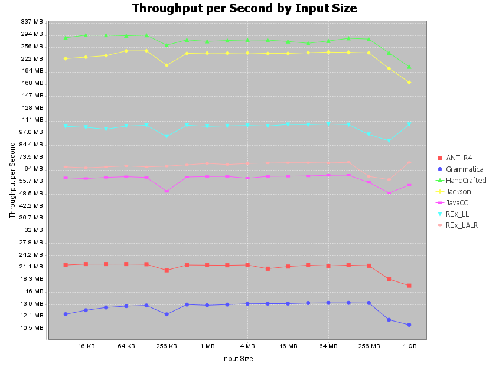

# REx Parser Benchmark

This is a comparison of the performance of parsers generated by [REx Parser Generator](https://www.bottlecaps.de/rex) to parsers from other parser generators. The task for each parser is to parse JSON input and create a result data structure. All parsers in a test must create the same result.

## Test plan
After a warm-up phase, all parsers are executed (repeatedly, if time permits) one after another for some minimum runtime on some given input. Runtime and memory usage are collected and logged. 

Before the next test cycle, the input size is increased by a given factor. This is done by wrapping multiple instances of each input file's content into JSON arrays. By default, a single flat top level array is used to do this, but there is an option to nest arrays deeply, i.e. wrapping multiple instances from the previous cycle's array into a new one.

Test cycles are repeated until eventually an OutOfMemoryError will occur, or until a parser requires more than twenty times the requested parse time. The default parsing time is 10 seconds, so if a parser needs 200 seconds or more, the test will stop.

Benchmark results are dumped to these files:
* `throughput.csv`
* `throughput.png`
* `memory.csv`
* `memory.png`

## Execution platforms

The benchmark covers two execution platforms:
* Java - parsers generated as Java code for direct invocation from Java.
* XQuery - parsers generated for use in XQuery, either generated as XQuery code, or generated as Java code for being used as an external function from XQuery, executed on [BaseX 10.8][BaseX] or [SaxonJ-HE 12.3][SaxonJ-HE].


## Available parsers in Java

The result of all parsers for Java is a [com.fasterxml.jackson.databind.JsonNode](http://fasterxml.github.io/jackson-databind/javadoc/2.14/com/fasterxml/jackson/databind/JsonNode.html) from the [Jackson](https://github.com/FasterXML/jackson) project. The result object represents the parsed JSON. 

These parsers are available:

| Parser Name   | Generator                    | Algorithm               |                                                        |
| :------------ | :--------------------------: | :---------------------: | :----------------------------------------------------- |
| `Jackson`     |                              |                         | Reference: [com.fasterxml.jackson.core.JsonParser][JP] |
| `HandCrafted` |                              | [recursive descent][RD] |                                                        |
| `REx_LL`      | [REx 5.56][Rex]              | [LL][LL]                |                                                        |
| `REx_LALR`    | [REx 5.56][Rex]              | [LALR][LALR]            |                                                        |
| `JavaCC`      | [JavaCC 7.0.12][JavaCC]      | [LL][LL]                |                                                        |
| `ANTLR4`      | [ANTLR 4.13.1][ANTLR4]       | [LL][LL]                |                                                        |
| `Grammatica`  | [Grammatica 1.6][Grammatica] | [LL][LL]                |                                                        |

## Available parsers in XQuery
The result of parsers for XQuery is an XML element as it would be produced by `fn:json-to-xml` (see definition in [XPath and XQuery 3.1 Functions and Operators](https://www.w3.org/TR/xpath-functions-31/#func-json-to-xml)).

| Parser Name            | Generator          | Algorithm        | Language | XQuery Processor       |                                   |
| :--------------------- | :----------------: | :--------------: | :------: | :--------------------: | :-------------------------------- |
| `BaseX`                |                    |                  | Java     | [BaseX][BaseX]         | Reference: [`fn:json-to-xml`][fn] |
| `BaseXRExLL`           | [REx 5.56][Rex]    | [LL][LL]         | XQuery   | [BaseX][BaseX]         |                                   |
| `BaseXRExLALR`         | [REx 5.56][Rex]    | [LALR][LALR]     | XQuery   | [BaseX][BaseX]         |                                   |
| `BaseXRExLLExternal`   | [REx 5.56][Rex]    | [LL][LL]         | Java     | [BaseX][BaseX]         |                                   |
| `BaseXRExLALRExternal` | [REx 5.56][Rex]    | [LALR][LALR]     | Java     | [BaseX][BaseX]         |                                   |
| `BaseXIxml`            | [Markup Blitz][MB] | [GLR][GLR]       | Java     | [BaseX][BaseX]         |                                   |
| `Saxon`                |                    |                  | Java     | [SaxonJ-HE][SaxonJ-HE] | Reference: [`fn:json-to-xml`][fn] |
| `SaxonRExLL`           | [REx 5.56][Rex]    | [LL][LL]         | XQuery   | [SaxonJ-HE][SaxonJ-HE] |                                   |
| `SaxonRExLALR`         | [REx 5.56][Rex]    | [LALR][LALR]     | XQuery   | [SaxonJ-HE][SaxonJ-HE] |                                   |
| `SaxonRExLLExternal`   | [REx 5.56][Rex]    | [LL][LL]         | Java     | [SaxonJ-HE][SaxonJ-HE] |                                   |
| `SaxonRExLALRExternal` | [REx 5.56][Rex]    | [LALR][LALR]     | Java     | [SaxonJ-HE][SaxonJ-HE] |                                   |
| `SaxonIxmlEarley`      | [CoffeeFilter][CF] | [Earley][Earley] | Java     | [SaxonJ-HE][SaxonJ-HE] |                                   |
<!-- disabled, waiting for https://github.com/nineml/nineml/issues/42
| `SaxonIxmlGLL`         | [CoffeeFilter][CF] | [GLL][GLL]       | Java     | [SaxonJ-HE][SaxonJ-HE] |                                   |
-->

## Building rex-parser-benchmark

Use Java 11 or higher to build.

For building `rex-parser-benchmark`, use these commands:

```sh
git clone https://github.com/GuntherRademacher/rex-parser-benchmark.git
cd rex-parser-benchmark 
gradlew build
```

After the project has been built with Gradle, it can also be imported into Eclipse.

## Running rex-parser-benchmark

The benchmark can be run with the `run` task:

```sh
gradlew run
```

The above command uses all defaults, it will run the Java parsers.

There are a number of command line options. These are shown when passing `-?` as an argument:

```sh
gradlew run "--args=-?"
```

This results in:

```log
Usage: java Benchmark <OPTION>... [<FILE>|<DIRECTORY>]

  read JSON file, or all *.json files in given directory (default: current dir). Restrict
  to those that are parseable by all parsers. Parse repeatedly. Log execution time.

  Options:

  -?, --help               show this message
  --platform [java|xquery] use Java or XQuery parser set
                             (default: java)
  --exclude <PARSER>       exclude <PARSER> from test
  --include <PARSER>       include <PARSER> in test
  --novalidation           skip comparison of parsing results
  --create-result          create result JsonObject (Java only,
                             XQuery always is executed with results)
  --warmup <TIME>          warm up parsers for <TIME> seconds
                             (default: 10)
  --time <TIME>            run each parser for <TIME> seconds
                             (default: 10)
  --factor <FACTOR>        increase input size by <FACTOR>
                             after each test cycle (default 2)
  --nest                   nest JSON arrays, when increasing input size. By
                             default, a single top level array will be used.
  --heapdump <SIZE>        dump heap when reaching <SIZE> (may contain fraction
                             and unit MB or GB) to file java_<PID>.hprof.
```

So for running the XQuery benchmark on file `src/main/resources/8KB.json`, use this command:

```sh
gradlew run --args="--platform xquery src/main/resources/8KB.json"
```

## Benchmark results - Java




## Benchmark results - XQuery


## License

This project is subject to the [Apache 2 License][ASL].

[ASL]: http://www.apache.org/licenses/LICENSE-2.0
[REx]: https://www.bottlecaps.de/rex
[MB]: https://github.com/GuntherRademacher/markup-blitz
[LL]: https://en.wikipedia.org/wiki/LL_parser
[GLL]: https://www.cs.rhul.ac.uk/research/languages/csle/GLLparsers.html
[GLR]: https://en.wikipedia.org/wiki/GLR_parser
[LALR]: https://en.wikipedia.org/wiki/LALR_parser
[BaseX]: https://basex.org/
[fn]: https://www.w3.org/TR/xpath-functions-31/#func-json-to-xml
[SaxonJ-HE]: https://www.saxonica.com/products/products.xml
[Earley]: https://en.wikipedia.org/wiki/Earley_parser
[CF]: https://github.com/nineml/coffeefilter   
[RD]: https://en.wikipedia.org/wiki/Recursive_descent_parser
[JavaCC]: https://javacc.github.io/javacc/
[ANTLR4]: https://www.antlr.org/
[Grammatica]: https://grammatica.percederberg.net/
[JP]: http://fasterxml.github.io/jackson-core/javadoc/2.14/com/fasterxml/jackson/core/JsonParser.html
